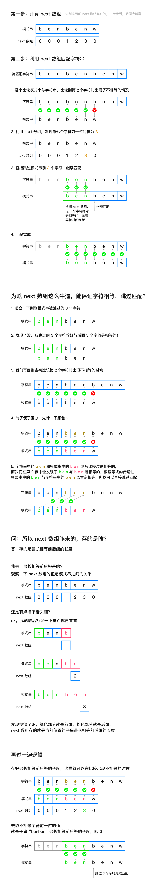

# 维基百科介绍
> 在计算机科学中，Knuth-Morris-Pratt字符串查找算法（简称为KMP算法）可在一个字符串S内查找一个词W的出现位置。一个词在不匹配时本身就包含足够的信息来确定下一个匹配可能的开始位置，此算法利用这一特性以避免重新检查先前配对的字符。这个算法由高德纳和沃恩·普拉特在1974年构思，同年詹姆斯·H·莫里斯也独立地设计出该算法，最终三人于1977年联合发表。

# 核心思想
利用最长相等前后缀跳过相等字符，避免多余计算

### 核心步骤
1. 计算模式串的最长相等前后缀数组（next 数组）
2. 利用 next 数组在匹配字符串时跳过相等的字符，直到匹配结束

# 图解


# Go 代码
``` Go
package problems

func strStr(haystack string, needle string) int {
	if len(needle) == 0 || len(haystack) == 0 {
		return -1
	}
	j := 0
	next := getNext(needle)
	for i := 0; i < len(haystack); i++ {
		for j > 0 && haystack[i] != needle[j] {
			j = next[j-1]
		}
		if haystack[i] == needle[j] {
			j++
		}
		if j == len(needle) {
			return i - len(needle) + 1
		}
	}
	return -1
}

func getNext(s string) []int {
	j := 0
	next := make([]int, len(s))
	next[0] = 0
	for i := 1; i < len(s); i++ {
		for j > 0 && s[j] != s[i] {
			j = next[j-1]
		}
		if s[j] == s[i] {
			j++
		}
		next[i] = j
	}
	return next
}

```
### 测试用例
``` Go
package problems

import (
	"reflect"
	"testing"
)

func Test_getNext(t *testing.T) {
	type args struct {
		s string
	}
	tests := []struct {
		name string
		args args
		want []int
	}{
		{
			name: "",
			args: args{
				s: "benbenw",
			},
			want: []int{0, 0, 0, 1, 2, 3, 0},
		},
	}
	for _, tt := range tests {
		t.Run(tt.name, func(t *testing.T) {
			if got := getNext(tt.args.s); !reflect.DeepEqual(got, tt.want) {
				t.Errorf("getNext() = %v, want %v", got, tt.want)
			}
		})
	}
}

func Test_strStr(t *testing.T) {
	type args struct {
		haystack string
		needle   string
	}
	tests := []struct {
		name string
		args args
		want int
	}{
		{
			name: "",
			args: args{
				haystack: "benbenbenw",
				needle:   "benbenw",
			},
			want: 3,
		},
	}
	for _, tt := range tests {
		t.Run(tt.name, func(t *testing.T) {
			if got := strStr(tt.args.haystack, tt.args.needle); got != tt.want {
				t.Errorf("strStr() = %v, want %v", got, tt.want)
			}
		})
	}
}

```

# 力扣相关题目
[力扣 28 题：找出字符串中第一个匹配项的下标](https://leetcode.cn/problems/find-the-index-of-the-first-occurrence-in-a-string/)
[力扣 459 题：重复的子字符串](https://leetcode.cn/problems/repeated-substring-pattern/)