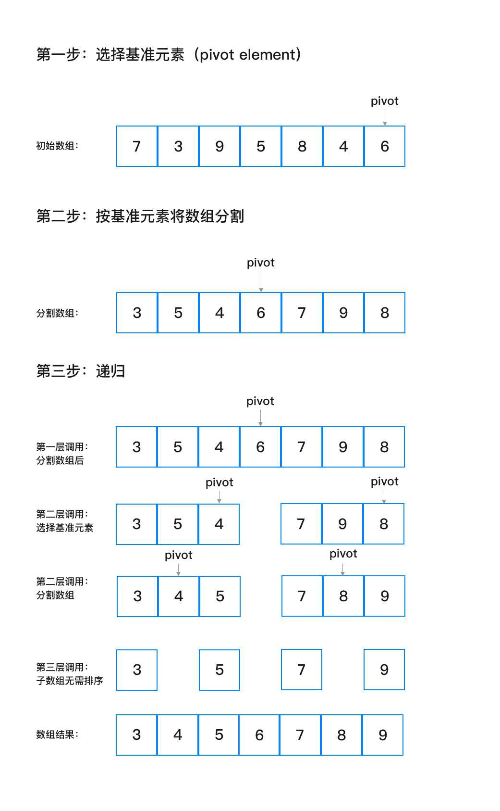

### 维基百科介绍

> 快速排序（英语：Quicksort），又称分区交换排序（partition-exchange sort），是一种排序算法，最早由东尼·霍尔提出。在平均状况下，排序 n 个项目要 O(nlogn) 次比较。在最坏状况下则需要 O(n2) 次比较，但这种状况并不常见。事实上，快速排序 Θ(nlog⁡n) 通常明显比其他算法更快，因为它的内部循环（inner loop）可以在大部分的架构上很有效率地达成。

### 核心步骤
1. 选择基准：选择待排序数组中的一个数字作为基准
2. 按基准分组：遍历数组元素，将小于基准值的数字移动到基准值左侧，大于的则移到右侧
3. 递归：在基准值左侧与右侧数组重复 1、2、3 步，直到所有数据排序完成

### 核心步骤图解


### C 代码
``` c
#include <stdio.h>

void EXCHANGE(int *left, int *right)
{
  if (left == right)
    return;
  *left ^= *right;
  *right ^= *left;
  *left ^= *right;
}

int PARTITION(int A[], int left, int right)
{
  int pivotValue = A[right];
  int pivotDest = left;
  for (int i = left; i < right; i++)
  {
    if (A[i] <= pivotValue)
    {
      EXCHANGE(&A[pivotDest], &A[i]);
      pivotDest++;
    }
  }
  EXCHANGE(&A[pivotDest], &A[right]);
  return pivotDest;
}

void QUICKSORT(int A[], int left, int right)
{
  if (left < right)
  {
    int pivot = PARTITION(A, left, right);
    QUICKSORT(A, left, pivot - 1);
    QUICKSORT(A, pivot + 1, right);
  }
}

int main(int argc, char const *argv[])
{
  int A[] = {7, 3, 9, 5, 8, 4, 2};
  QUICKSORT(A, 0, 7);
  for (int i = 0; i <= 7; i++)
  {
    printf("%d ", A[i]);
  }
  printf("\n");
  return 0;
}

```

### Go 代码
``` Go
package sort

func QuickSort(a []int) []int {
	partition := func(a []int, lo, hi int) int {
		i, j := lo+1, hi
		for {
			for ; i < hi && a[i] <= a[lo]; i++ {
			}
			for ; j > lo && a[j] >= a[lo]; j-- {
			}
			if j <= i {
				break
			}
			a[i], a[j] = a[j], a[i]
		}
		a[i-1], a[lo] = a[lo], a[i-1]
		return i - 1
	}

	var sort func(a []int, lo, hi int)
	sort = func(a []int, lo, hi int) {
		if lo >= hi {
			return
		}
		j := partition(a, lo, hi)
		sort(a, lo, j-1)
		sort(a, j+1, hi)
	}
	sort(a, 0, len(a)-1)
	return a
}

```
### 改进
数组偏小时改用插入排序
```go
if lo+M >= hi {
	InsertionSort(a, lo, hi)
	return
}
```
